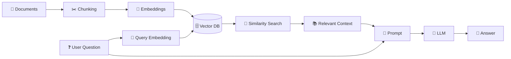

# 🧠 RAG Engineering Lab

> **A hands-on journey from "what is RAG?" → production-grade Retrieval-Augmented Generation systems.**


---

## ⚡ What is this repository?

This is my **RAG learning laboratory**

I'm not treating this as a "watch a course and move on" repository. Every concept is being:

- 🧩 understood from first principles
- 💻 implemented in code
- 🔬 experimented with
- 📝 documented for future reference
- 🚀 gradually pushed toward production

The goal is to understand **why every component exists, where it fits, and how the pieces connect** — not just copy LangChain code.

> **Learning milestone:** ✅ RAG Foundations → Advanced Retrieval → Cost Optimization → Observability → Production Concepts  
> **Completed:** Hands-on implementations, experiments, LangSmith tracing, advanced retrieval patterns, and production architecture concepts  
> **Next:** 🚀 Build a separate production-grade RAG project

---

## 🗺️ RAG Mental Model

The core architecture I'm building toward:



### The simplest definition

> **Retrieve relevant information → augment the prompt with it → let the LLM generate the answer.**

**R** → Retrieval 🔎  
**A** → Augmentation ➕  
**G** → Generation 🤖

---

# 📚 Learning Roadmap

The course is being turned into a structured engineering roadmap.

<details>
<summary><b>🟢 PHASE 1 — RAG Foundations</b></summary>

| # | Topic | Status |
|---|---|---|
| 01 | Intro | ✅ |
| 02 | Full RAG Overview | ✅ |
| 03 | Development Environment Setup | ✅ |
| 04 | Document Loader | ✅ |
| 05 | Document Processing / Indexing Pipeline | ✅ |
| 06 | Embedding Dimensions — Deep Dive | ✅ |
| 07 | Chroma Vector Database | ✅ |
| 08 | Similarity Search with Scores | ✅ |
| 09 | Basic RAG System | ✅ |

### Concepts understood so far

- What RAG actually solves
- Document loading
- Chunking
- `RecursiveCharacterTextSplitter`
- `chunk_size` and `chunk_overlap`
- Embeddings
- Embedding dimensions
- Vector databases
- ChromaDB
- Similarity search
- Similarity distance / scores
- Metadata
- Metadata filtering
- Retrievers
- Context formatting
- Prompt templates
- `RunnablePassthrough`
- LangChain RAG chains
- LLM generation
- Embedding debugging
- Chunk-size and chunk-overlap experiments
- BM25 retrieval
- Vector + BM25 hybrid search
- Score normalization and hybrid score fusion
- Model routing
- Semantic caching
- Token budgeting

</details>

<details>
<summary><b>🟡 PHASE 2 — RAG Quality & Retrieval</b></summary>

| # | Topic | Status |
|---|---|---|
| 10 | Debugging RAG Systems | ✅ |
| 11 | Token Budgeting | ✅ |
| 12 | Hybrid Search | ✅ |
| 13 | Observability Introduction | ✅ |
| 14 | LangSmith Setup | ✅ |
| 15 | RAG Optimization | ✅ |

Focus:

```text
Why did retrieval fail?
Why was the wrong chunk retrieved?
How much context should we send?
How do we measure RAG quality?
How do we debug a RAG pipeline?
```

</details>

<details>
<summary><b>🔵 PHASE 3 — Production RAG</b></summary>

| # | Topic | Status |
|---|---|---|
| 16 | Scaling RAG Systems | ✅ |
| 17 | Real Costs of Vector Search | ✅ |
| 18 | Production Hosting | ✅ |
| 19 | Supabase + PGVector | ✅ |
| 20 | Three Pillars of Production Visibility | ✅ |
| 21 | Production Project | 🚀 Next — separate project |

Focus:

- scalability
- latency
- cost
- vector database architecture
- hosting
- production monitoring
- real-world deployment

</details>

<details>
<summary><b>🟣 COMPLETED — Advanced Retrieval Techniques</b></summary>

| Technique | Status | What I implemented |
|---|---|---|
| Multi-Query Retrieval | ✅ | Generate multiple query perspectives before retrieval |
| Contextual Compression | ✅ | Use Gemini to keep query-relevant information from retrieved context |
| Ensemble Retrieval | ✅ | Combine vector retrieval with BM25 using weighted ranking |
| Parent Document Retrieval | ✅ | Search small child chunks while returning larger parent context |
| Advanced RAG Pipeline | ✅ | Combine retrieval, compression, and generation |

</details>

<details>
<summary><b>🔴 PHASE 4 — Production Security & Agents</b></summary>

| # | Topic | Status |
|---|---|---|
| 22 | Security Layer | 🔜 |
| 23 | LangGraph Agent + FastAPI API | 🔜 |
| 24 | Testing | 🔜 |
| 25 | LangSmith Observability Dashboard | 🔜 |
| 26 | Security Layer Testing | 🔜 |
| 27 | Security Checklist | 🔜 |

The goal here is to move from:

```text
"RAG demo"
        ↓
"RAG application"
        ↓
"production API"
```

</details>

<details>
<summary><b>🟣 PHASE 5 — Advanced RAG</b></summary>

| # | Topic | Status |
|---|---|---|
| 28 | Long Context Models vs RAG | 🔜 |
| 29 | Contextual Retrieval | 🔜 |
| 30 | Late Chunking vs Early Chunking | 🔜 |
| 31 | Agentic / Self-Correcting RAG | 🔜 |
| 32 | GraphRAG / Multi-hop Reasoning | 🔜 |
| 33 | Multimodal RAG + ColPali | 🔜 |
| 34 | Advanced RAG — Current State | 🔜 |
| 35 | RAG Evolution | 🔜 |

</details>

---

# 🧱 What I've Built So Far

### Current basic RAG pipeline

```text
📄 Knowledge Base
       ↓
✂️ Recursive Character Text Splitter
       ↓
📦 Document Chunks
       ↓
🧠 Gemini Embedding Model
       ↓
🔢 Embedding Vectors
       ↓
🗄️ ChromaDB
       ↓
🔎 Retriever
       ↓
📚 Relevant Chunks
       ↓
🧹 format_docs()
       ↓
📝 Context + Question
       ↓
🤖 Gemini LLM
       ↓
💬 Final Answer
```

### The two sides of RAG

**INDEXING — happens before the user asks anything**

```text
Documents
   ↓
Chunks
   ↓
Embeddings
   ↓
ChromaDB
```

**QUERY — happens when the user asks a question**

```text
Question
   ↓
Query Embedding
   ↓
Similarity Search
   ↓
Relevant Chunks
   ↓
Context + Question
   ↓
LLM
   ↓
Answer
```

---

# 🛠️ Current Tech Stack

| Technology | Why I'm using it |
|---|---|
| 🐍 Python | Core language |
| ⚡ uv | Fast Python package/project management |
| 🦜 LangChain | RAG orchestration |
| 🧠 Gemini | Embeddings + LLM |
| 🗄️ ChromaDB | Vector storage + similarity search |
| 📄 Document loaders | Bringing external knowledge into the pipeline |
| ✂️ Text Splitters | Chunking documents |
| 🧪 LangSmith | LLM observability, tracing, debugging, and run inspection |
| 🐘 PostgreSQL / PGVector | Production-oriented relational + vector storage |
| 🕸️ LangGraph | Future agentic RAG work |
| 🚀 FastAPI | Production API architecture for the next project |

---

# 🏭 Production Concepts Learned

### Observability

Production RAG needs visibility into three complementary layers:

```text
Logs
  → What happened?

Metrics
  → How often / how much / how fast?

Traces
  → What happened across one complete request?
```

With LangSmith, I learned how to trace LLM/RAG runs, inspect inputs and outputs, debug latency and failures, and understand individual steps inside a pipeline.

### Supabase + PGVector

Chroma was used for learning local vector retrieval. For a production application, PostgreSQL + `pgvector` can keep relational application data and embeddings/vector-search data in the same database architecture.

Supabase provides a managed PostgreSQL environment that can be used for this setup.

I learned the setup flow and the role of database credentials, Supabase, and PGVector. I intentionally did **not** migrate this entire learning repository just to replace Chroma. That implementation belongs in the production project where the architecture actually requires it.

### Production visibility

The production mindset is:

```text
Logging + Metrics + Traces
             ↓
       Observability
             ↓
 Debugging + Reliability + Cost Control
```

Other production concepts covered include scaling, vector-search costs, hosting, retrieval optimization, and the trade-offs involved when moving from a local RAG demo to a real application.

---

# 📂 Repository Structure

The structure will evolve as the course gets deeper.

```text
RAG/
│
├── 📁 docs/
│   └── sample_rag_document.pdf
│
├── 📁 src/
│   └── 📁 rag/
│       └── __init__.py
│
├── 📄 document_loader.py
├── 📄 main.py
├── 📄 rag_pipeline.py
│
├── 🔐 .env                 # local only — never commit
├── 🚫 .gitignore
├── ⚙️ pyproject.toml
├── 🔒 uv.lock
└── 📖 README.md
```

As new concepts appear, this repository will grow rather than being replaced with separate projects.

---

# 🧪 Experiments & Notes

This repository is intentionally **hands-on**.

Future experiments will live alongside the implementations:

```text
similarity search
      ↓
metadata filtering
      ↓
embedding debugging
      ↓
hybrid search
      ↓
model routing
      ↓
semantic caching
      ↓
token budgeting
      ↓
reranking
      ↓
retrieval evaluation
      ↓
RAG optimization
      ↓
production architecture
```

The idea is to keep the **learning trail visible** instead of hiding everything behind one final polished project.

---

# 🧠 Core Concepts I'm Building

### Embeddings

```text
Text
 ↓
Embedding Model
 ↓
Vector
```

Used so semantic similarity can be measured mathematically.

### Vector Search

```text
Query Vector
      ↓
Compare
      ↓
Stored Document Vectors
      ↓
Most Relevant Chunks
```

### Metadata

```text
Document
├── content
└── metadata
    ├── source
    ├── page
    ├── category
    └── ...
```

Metadata allows filtering **before / during retrieval**, depending on the retrieval setup.

### RAG

```text
Retrieve
   +
Augment
   +
Generate
   =
RAG
```

---

# 🎯 End Goal

By the end of this repository, I want to be able to build a RAG system that is:

```text
                 ┌─────────────────────┐
                 │   Production RAG     │
                 └──────────┬──────────┘
                            │
        ┌───────────────────┼───────────────────┐
        ↓                   ↓                   ↓
   🔎 Retrieval        🤖 Generation       📊 Observability
        │                   │                   │
   Vector Search        LLMs               LangSmith
   Hybrid Search       Prompting           Tracing
   Reranking           Context             Evaluation
        │
        ├── Chroma
        └── PGVector

        ┌─────────────────────────────────────┐
        │ Security • Scaling • Cost • APIs    │
        │ FastAPI • LangGraph • Production    │
        └─────────────────────────────────────┘
```

Eventually:

> **From a basic local RAG demo → to a secure, observable, scalable, production-ready AI application.**

---

# 📈 Progress

### Final learning position

```text
FOUNDATIONS
████████████████████████████████████████

🟢 Basic RAG
🟢 Debugging RAG
🟢 Hybrid Search
🟢 Model Routing
🟢 Semantic Caching
🟢 Token Budgeting
🟢 Multi-Query Retrieval
🟢 Contextual Compression
🟢 Parent Document Retrieval
🟢 Ensemble Retrieval
🟢 LangSmith
🟢 Observability
🟢 RAG Optimization
🟢 Scaling / Vector Search Cost Concepts
🟢 Supabase + PGVector Concepts
🟢 Production Architecture Concepts

🚀 NEXT: Build a real production RAG application
```

### Learning rule

> **Understand first. Implement second. Optimize third.**

I'm intentionally not speed-running the course. If a 20-second code section takes an hour to properly understand, that hour is part of the learning.

---

# 🧪 Recent Hands-on Milestones

The repository has now moved beyond the basic RAG pipeline into retrieval debugging and production-oriented cost optimization.

| Concept | Status | What I implemented |
|---|---|---|
| Chunking Debugging | ✅ | Chunk-size and overlap experiments |
| Embedding Debugging | ✅ | Dimensions, vector norms, cosine similarity |
| Metadata Filtering | ✅ | Metadata-based retrieval filtering |
| BM25 | ✅ | Keyword-based retrieval |
| Vector Search | ✅ | Semantic retrieval with embeddings |
| Hybrid Search | ✅ | BM25 + vector retrieval with normalized score fusion |
| Model Routing | ✅ | Route simple/complex queries to different Gemini models |
| Semantic Caching | ✅ | Cache semantically similar queries using embeddings |
| Token Budgeting | ✅ | Estimate and reject oversized requests |

> These implementations are intentionally educational and lightweight. The goal is to understand the underlying architecture before moving toward production-grade infrastructure.

---

# 🎬 Course Reference

This repository follows the RAG course chapter-by-chapter.

**Course:** RAG From Scratch → Production RAG

[▶️ Watch the full course](https://www.youtube.com/watch?v=mHxLXzYjQRE)

<details>
<summary><b>📺 Full Chapter Timeline</b></summary>

| Time | Chapter |
|---|---|
| 00:00 | Intro |
| 01:44 | Full RAG Overview |
| 08:27 | Development Environment Setup |
| 15:35 | Document Loader |
| 28:27 | RAG Indexing Pipeline |
| 48:12 | Embedding Dimensions |
| 1:01:05 | Chroma Vector DB |
| 1:13:49 | Token Budgeting |
| 1:17:48 | Similarity Search with Scores |
| 1:24:32 | Basic RAG |
| 1:33:16 | Debugging RAG |
| 1:53:46 | Hybrid Search |
| 2:21:10 | Observability |
| 2:29:56 | LangSmith |
| 2:37:56 | RAG Optimization |
| 3:12:58 | Scaling RAG |
| 3:23:35 | Cost of Vector Search |
| 3:33:17 | Production Hosting |
| 3:36:00 | Supabase + PGVector |
| 4:04:41 | Production Visibility |
| 4:16:11 | Production Project |
| 4:34:36 | Security Layer |
| 4:16:11 | LangGraph + FastAPI + LangSmith |
| 5:27:46 | Security Testing |
| 5:41:36 | Security Checklist |
| 6:06:09 | Long Context vs RAG |
| 6:14:29 | Contextual Retrieval |
| 6:24:26 | Late vs Early Chunking |
| 6:42:04 | Agentic RAG |
| 7:04:45 | GraphRAG |
| 7:24:28 | Multimodal RAG + ColPali |
| 7:34:45 | Advanced RAG Summary |
| 7:37:02 | RAG Evolution |
| 7:38:35 | Outro |

</details>

---

# 📝 Learning Log

I'll keep adding milestones here as the repository grows.

### 🟢 Milestone 01 — RAG Foundations

- [x] Understand the RAG architecture
- [x] Set up Python + uv environment
- [x] Load documents
- [x] Understand document processing
- [x] Understand chunking
- [x] Understand embeddings
- [x] Understand embedding dimensions
- [x] Create Chroma vector store
- [x] Perform similarity search
- [x] Understand similarity scores
- [x] Implement basic RAG
- [x] Connect retrieval → context → prompt → LLM

### 🟢 Milestone 02 — Retrieval Engineering & Cost Optimization

- [x] Debug retrieval failures
- [x] Debug chunking behavior
- [x] Understand embedding dimensions and vector norms
- [x] Token budgeting
- [x] Hybrid search
- [x] BM25 + vector score normalization
- [x] Model routing
- [x] Semantic caching
- [x] Improve retrieval quality

### 🟢 Milestone 03 — Advanced RAG & Production Concepts

- [x] Multi-Query Retrieval
- [x] Contextual Compression
- [x] Ensemble / Hybrid Retrieval
- [x] Parent Document Retrieval
- [x] Combined advanced RAG pipeline
- [x] Logging, metrics, and traces
- [x] LangSmith setup and tracing
- [x] RAG optimization concepts
- [x] Scaling and vector-search cost concepts
- [x] Production hosting concepts
- [x] Supabase + PGVector architecture
- [x] Three pillars of production visibility
- [x] Push relevant implementations and experiments

### 🚀 Milestone 04 — Production Build

- [ ] Design a real-world RAG application
- [ ] Use production database/vector infrastructure where appropriate
- [ ] Add authentication and security
- [ ] Add evaluation and testing
- [ ] Add production observability
- [ ] Deploy and monitor the application

---

## ✅ Status — Learning Phase Complete

**This repository is now closed as a learning project.**

The tutorial has been completed hands-on. The relevant implementations and experiments have been pushed, and the next step is a separate production project rather than adding more tutorial code here.

```text
RAG Foundations
      ↓
Retrieval Engineering
      ↓
Cost Optimization
      ↓
Advanced Retrieval
      ↓
LangSmith Observability
      ↓
Production Architecture Concepts
      ↓
🚀 Production Project
```

> **From understanding RAG → to engineering a production RAG system.**

---

### ⭐ If you're following along

Don't just copy the code.

Ask:

```text
WHY does this component exist?
WHAT problem does it solve?
WHERE does its output go?
WHAT consumes that output?
WHAT happens if it fails?
```

That's the difference between **knowing RAG syntax** and **understanding RAG architecture**.
